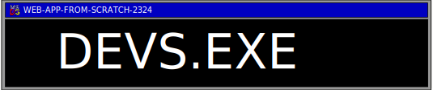

# 

# About
Devs.exe is an innovative project that reimagines the conventional user interface by merging the aesthetics of a classic operating system with modern web technologies. Rooted in JavaScript, Devs.exe leverages asynchronous data fetching techniques to dynamically populate its interface with information retrieved from various GitHub repositories.

By harnessing the power of asynchronous programming, Devs.exe seamlessly integrates data from multiple sources, each representing a member of the development team. Through meticulously crafted JavaScript functions, the project aggregates data sets authored by team members such as Sena, Fayaaz, Niels, Ali, and Ufuk, creating a cohesive and comprehensive representation of the team's collective expertise.

The project's user interface emulates the familiar look and feel of a Windows system, complete with draggable and resizable windows, reminiscent of the operating systems of yesteryears. Each team member's data is encapsulated within a draggable window, providing users with an interactive and intuitive experience as they explore the wealth of information presented.

Devs.exe not only showcases the technical proficiency of its creators but also serves as a testament to their creativity and innovation. By blending nostalgic design elements with cutting-edge web development techniques, Devs.exe offers a unique and captivating user experience that bridges the gap between past and present, inviting users to embark on a journey of exploration and discovery within the realm of software development.

# GitHub

To gain a deeper understanding of our repository and access related content, you can `clone` our repository using the git clone command in your command prompt. Prior to cloning, ensure that you have defined and created a local directory.
<pre><code>git clone https://github.com/N13L5A97/Devs.exe.git</code></pre>

# HTML
The provided HTML structure includes a `<main>` element where dynamic content is appended, a `<footer>` element containing a start button for triggering actions, and script references for JavaScript functionality. The start button, styled and positioned via an external CSS file, allows users to initiate interactions within the web application. Overall, the HTML serves as a foundation for dynamic content generation and interactivity facilitated by `JavaScript`.

```HTML
<!DOCTYPE html>
<html lang="en">
<head>
    <meta charset="UTF-8">
    <meta name="viewport" content="width=device-width, initial-scale=1.0">
    <title>Devs.exe</title>
    <link rel="stylesheet" href="./styles/styles.css">
</head>
<body>
    <main>
    </main>
    <footer>
        <button>
            
        </button>
    </footer>

    <!-- <script src="./script.js"></script> -->
    <script src="./script.js"></script>
</body>
</html>
```
# CSS

## Font Definition
Defines a custom font named `classicWindows` using @font-face, providing a source URL for the font file.

``source`` : https://fontstruct.com/fontstructions/show/1662281/ms-sans-serif-6-1
```CSS 
@font-face {
  font-family: classicWindows;
  src: url(./ms-sans-serif.otf);
}
```
## Root Variables
Defines root-level variables for consistent color usage throughout the stylesheet, including background, text, taskbar, and title colors.

```CSS
:root {
  --background-color: #008080;
  --text-color-dark: #000;
  --text-color-light: #fff;
  --taskbar-color: #d9d9d9;
  --title-background-color: #000080;
}
```

## Reset Styles
Resets `margin`, `padding`, and `box-sizing` for all elements to ensure consistent rendering across different browsers.

```CSS
* {
  margin: 0;
  padding: 0;
  box-sizing: border-box;
}
```
## Body Styles
Applies styles to the `<body>` element, setting background color, text color, height, and overflow behavior.


```CSS
body {
  background-color: var(--background-color);
  color: var(--text-color);
  height: 100vh;
  overflow: hidden;
}
```

## Main Element Styling
Styles the `<main>` element to occupy the entire viewport width and height.

```CSS
main {
  width: 100vw;
  height: 100vh;
}
```

## Footer Styling
Defines styles for the `<footer>`, positioning it at the bottom with specific dimensions, `padding`, and `background-color`.
```CSS
footer {
  position: absolute;
  bottom: 0;
  z-index: 10;
  display: flex;
  flex-direction: row;
  padding: 0.5rem;
  height: 3rem;
  width: 100vw;
  background-color: var(--taskbar-color);
}
```

## Button Styling
Styles buttons to have no border, `transparent` background, and a subtle transform effect on click.

```CSS
button {
  border: none;
  background-color: transparent;
  height: min-content;
}

button:active {
  transform: translateY(1px);
}
```

## View Element Styling
Defines styles for view elements, positioning them absolutely with initial coordinates and a default hidden state.
```CSS
.view {
  position: absolute;
  top: 10%;
  left: 10%;
  z-index: 1;
  background-color: var(--taskbar-color);
  display: none;
}
```
## Title Styling 
Styles titles within views with specific background color, text color, height, padding, and font size.

```CSS
.title {
  background-color: var(--title-background-color);
  color: var(--text-color-light);
  height: 1.5rem;
  display: flex;
  justify-content: space-between;
  padding: 0.5em;
  gap: 3em;
  font-size: 0.6rem;
}

```

## Button Container  Styling 
Defines styles for button containers within views, ensuring proper alignment and spacing.

```CSS
.buttonContainer {
  margin-bottom: -0.25rem;
  display: flex;
  align-items: center;
}
```

## Data Container Styling
Styles data containers within views with specific background color, text color, dimensions, and scroll behavior.
```CSS
.dataContainer {
  margin: 0.5em;
  padding: 0.5em;
  background-color: var(--text-color-dark);
  color: var(--text-color-light);
  height: 50vh;
  width: 50vw;
  overflow: scroll;
}
```
## Icon Container Styling
Defines styles for icon containers, such as alignment, dimensions, positioning, margin, and padding.

```CSS
.imgContainer {
  display: flex;
  flex-direction: column;
  align-items: center;
  height: 5em;
  width: 5em;
  margin: 1em;
  position: absolute;
  left: 0;
  top: 0;
  padding: 0.2em;
}
```
## Avatar Styling
Styles avatar images within icon containers to occupy the full height.
```CSS
.avatar {
  height: 100%;
}

```

## Pre Element Styling
Defines scroll behavior for `<pre>` elements to handle overflow content.
```CSS
pre {
  overflow: scroll;
}

```


# JS
## Fetching Data
The JavaScript code begins by defining asynchronous functions to fetch data from various sources, including Sena, Fayaaz, Niels, Ali, and Ufuk. Each function makes an asynchronous call using `fetch` to retrieve JSON data from a specific URL. Error handling is implemented using `try-catch` blocks to catch any potential errors during the data fetching process.

```JS
//fetch Ali Data
const aliData = async () => {
  try {
    const data = await fetch('https://raw.githubusercontent.com/AliAhmed205/web-app-from-scratch-2324/main/docs/scripts/data.json')
    .then((res) => res.json());

    console.log(data);
    return data;
  } catch (error) {
    console.error("Error fetching data:", error);
  }
};
```

## Combining Data
To combine the fetched data from different sources into a single array, there's a function named `combineFunction`. This function utilizes `Promise.all()` to asynchronously fetch data from all the defined sources. Once all the data is fetched successfully, it's logged to the console and returned as a combined array. Error handling is implemented to catch any errors that might occur during the data combination process.

```JS
const combineFunction = async () => {
  try{
    const combinedData = await Promise.all([senaData(), nielsData(), aliData(), ufukData(), fayaazData()]);

    console.log(combinedData);

    return combinedData;
  } catch (error){
    console.error("Error combining data:", error);
  }
};
```

## Creating Icons
The `createIcon` function is responsible for dynamically creating icon elements based on the fetched data. It iterates over the combined data array and creates HTML elements for each member's icon, including an image and a filename. These elements are appended to the main document. Random positioning is applied to each icon using CSS styling.

```JS
const createIcon = async () => {
  const data = await combineFunction();

  data.forEach((member) => {
    const imgContainer = document.createElement("article");
    imgContainer.classList.add("imgContainer");
    imgContainer.id = member.firstName;

    const avatar = document.createElement("img");
    avatar.src = member.avatar_url;
    avatar.alt = "avatar";
    avatar.classList.add("avatar");

    const fileName = document.createElement("p");
    fileName.classList.add("fileName");
    fileName.innerHTML = `${member.firstName}.exe`;

    imgContainer.appendChild(avatar);
    imgContainer.appendChild(fileName);

    const main = document.querySelector("main");
    main.appendChild(imgContainer);

    const randomLeft = Math.floor(Math.random() * 75);
    const randomTop = Math.floor(Math.random() * 75);

    imgContainer.style.left = `${randomLeft}%`;
    imgContainer.style.top = `${randomTop}%`;

    // Ali's added function 
    imgContainer.addEventListener("click", () => {
      const selectedContainers = document.querySelectorAll(".imgContainer");
      selectedContainers.forEach(container => {
        if (container !== imgContainer) {
          container.style.backgroundColor = "transparent";
          container.style.border = "transparent";
          fileName.style.color = "black"
          fileName.backgroundColor = "transparent"

        }
      });
      imgContainer.style.backgroundColor = "#00007b";
      imgContainer.style.border = "dashed 1px white";
      fileName.style.backgroundColor = "#00007b";
      fileName.style.color = "white";
    });

    // Event listener added for double clicking
    imgContainer.addEventListener("dblclick", (event) => {
      event.stopPropagation(); 

      const viewId = imgContainer.id;
      const view = document.getElementById(viewId);

      // See if the window is already open, if not, open it
      if (view.style.display !== "block") {
        view.style.display = "block";

        // When the window is closed, set the background of the imgContainer back to transparent
        view.querySelector(".buttonContainer button:last-child").addEventListener("click", () => {
          imgContainer.style.backgroundColor = "transparent";
          fileName.style.backgroundColor = "transparent";
          fileName.style.color = "black"
        ;

        });
      }
    });
  });
};
```

## Selected Icon
A feature is added to highlight the selected icon when clicked. This is achieved by changing the background color and border of the selected icon while reverting the others to their default state. Additionally, a double-click event listener is added to each icon to handle opening the corresponding view.

```JS
    imgContainer.addEventListener("click", () => {
      const selectedContainers = document.querySelectorAll(".imgContainer");
      selectedContainers.forEach(container => {
        if (container !== imgContainer) {
          container.style.backgroundColor = "transparent";
          container.style.border = "transparent";
          fileName.style.color = "black"
          fileName.backgroundColor = "transparent"

        }
      });
      imgContainer.style.backgroundColor = "#00007b";
      imgContainer.style.border = "dashed 1px white";
      fileName.style.backgroundColor = "#00007b";
      fileName.style.color = "white";
    });

    // Event listener added for double clicking
    imgContainer.addEventListener("dblclick", (event) => {
      event.stopPropagation(); 

      const viewId = imgContainer.id;
      const view = document.getElementById(viewId);

      // See if the window is already open, if not, open it
      if (view.style.display !== "block") {
        view.style.display = "block";

        // When the window is closed, set the background of the imgContainer back to transparent
        view.querySelector(".buttonContainer button:last-child").addEventListener("click", () => {
          imgContainer.style.backgroundColor = "transparent";
          fileName.style.backgroundColor = "transparent";
          fileName.style.color = "black"
        ;

        });
      }
    });
```

## Creating Views
The `createViewElements`` function is responsible for dynamically creating view elements based on the combined data array. For each member's data, it creates a section element representing the view, including title, buttons, and data container. Random positioning is applied to each view element. Event listeners are added to the close, maximize, and view elements for interaction.

```JS
const createViewElements = async () => {
  const data = await combineFunction();
  // console.log(data);

  data.forEach((member) => {
    const dataString = JSON.stringify(member, null, 2);

    // create section element (view)
    const view = document.createElement("section");
    view.classList.add("view");
    view.id = member.firstName;

    // create section element (title)
    const title = document.createElement("section");
    title.classList.add("title");

    // create h2 element
    const pathName = document.createElement("h2");
    pathName.innerHTML = `C:\\Windows\\system32\\${member.firstName}.exe`;

    // create div element (buttonContainer)
    const buttonContainer = document.createElement("div");
    buttonContainer.classList.add("buttonContainer");

    //create button (minusButton)
    const minusButton = document.createElement("button");

    //create button (fillButton)
    const fillButton = document.createElement("button");

    //create button (closeButton)
    const closeButton = document.createElement("button");

    //create image (minusImage)
    const minusImage = document.createElement("img");
    minusImage.src = "./assets/minButton.png";
    minusImage.alt = "minus button";

    //create image (fillImage)
    const fillImage = document.createElement("img");
    fillImage.src = "./assets/fillButton.png";
    fillImage.alt = "fill button";

    //create image (closeImage)
    const closeImage = document.createElement("img");
    closeImage.src = "./assets/closeButton.png";
    closeImage.alt = "close button";

    // create article element (dataContainer)
    const dataContainer = document.createElement("article");
    dataContainer.classList.add("dataContainer");

    const userData = document.createElement("pre");
    userData.innerHTML = dataString;

    //put image in buttons
    minusButton.appendChild(minusImage);
    fillButton.appendChild(fillImage);
    closeButton.appendChild(closeImage);

    //put userData in dataContainer
    dataContainer.appendChild(userData);

    //put pathname and buttons in title
    title.appendChild(pathName);
    title.appendChild(buttonContainer);

    //put buttons in button container
    buttonContainer.appendChild(minusButton);
    buttonContainer.appendChild(fillButton);
    buttonContainer.appendChild(closeButton);

    view.appendChild(title);
    view.appendChild(dataContainer);

    const main = document.querySelector("main");
    main.appendChild(view);

    //give view random position

    const randomLeft = Math.floor(Math.random() * 49);
    const randomTop = Math.floor(Math.random() *38);

    view.style.left = `${randomLeft}%`;
    view.style.top = `${randomTop}%`;

    // when close button pressed close the right view
    //little help from copilot
    closeButton.addEventListener("click", () => {
      view.style.display = "none";
    });

    // when view is clicked bring to front
    view.addEventListener("click", () => {
      //z index + 1
      view.style.zIndex++;
    });


    // when fill button is pressed fill the right view
    let isFull = false;

    fillButton.addEventListener("click", () => {
      if (isFull === false) {
        //find the right view and dataContainer
        const view = document.getElementById(member.firstName);
        const dataContainer = document
          .getElementById(member.firstName)
          .querySelector(".dataContainer");

        isFull = true;
        console.log(isFull);

        dataContainer.style.height = "100vh";
        dataContainer.style.width = "99vw";
        view.style.left = "0";
        view.style.top = "0";
        // console.log(member.firstName);
      } else {
        //find the right view and dataContainer
        const view = document.getElementById(member.firstName);
        const dataContainer = document
          .getElementById(member.firstName)
          .querySelector(".dataContainer");

        isFull = false;
        console.log(isFull);

        dataContainer.style.height = "50vh";
        dataContainer.style.width = "50vw";

        const randomLeft = Math.floor(Math.random() * 49);
        const randomTop = Math.floor(Math.random() * 38);

        view.style.left = `${randomLeft}%`;
        view.style.top = `${randomTop}%`;
      }
    });
  });
};

```

## Close, Minimizing and Maximize View
Event listeners are added to the close and maximize buttons within each view element. When the close button is clicked, the corresponding view is hidden. When the fill button is clicked, the view is maximized to fill the entire viewport, and clicking it again restores it to its original size with random positioning.

### Maximize
```JS
// when close button pressed close the right view
//little help from copilot
closeButton.addEventListener("click", () => {
    view.style.display = "none";
});

// when fill button is pressed fill the right view
let isFull = false;

fillButton.addEventListener("click", () => {
    if (isFull === false) {
        //find the right view and dataContainer
        const view = document.getElementById(member.firstName);
        const dataContainer = document
            .getElementById(member.firstName)
            .querySelector(".dataContainer");

        isFull = true;
        console.log(isFull);

        dataContainer.style.height = "100vh";
        dataContainer.style.width = "99vw";
        view.style.left = "0";
        view.style.top = "0";
    } else {
        //find the right view and dataContainer
        const view = document.getElementById(member.firstName);
        const dataContainer = document
            .getElementById(member.firstName)
            .querySelector(".dataContainer");

        isFull = false;
        console.log(isFull);

        dataContainer.style.height = "50vh";
        dataContainer.style.width = "50vw";

        const randomLeft = Math.floor(Math.random() * 49);
        const randomTop = Math.floor(Math.random() * 38);

        view.style.left = `${randomLeft}%`;
        view.style.top = `${randomTop}%`;
    }
});

```

## Closing
```JS
const closeButton = document.createElement("button");

    closeButton.appendChild(closeImage);
    buttonContainer.appendChild(closeButton);
      
      const closeImage = document.createElement("img");
      closeImage.src = "./assets/closeButton.png";
      closeImage.alt = "close button";


      closeButton.addEventListener("click", () => {
        view.style.display = "none";
      });

      view.addEventListener("click", () => {
        view.style.zIndex = z;
        z++;
      });
```
## Minimizing
To minimize a view and put them into the start menu just like how windows operates, we made this button into an object that is being placed into the footer to 
recreate the minimizing effect. 
```JS
// hiding the view when clicking minimize button. 
const minusButton = document.createElement("button");
      minusButton.addEventListener("click", () => {
        view.style.display = "none";
      })
```

```JS

//creating and linking the button to the corrosponding person being clicked. 
      imgContainer.addEventListener("dblclick", (event) => {
        event.stopPropagation();

        const viewId = imgContainer.id;
        const view = document.getElementById(viewId);

        const footer = document.querySelector("footer");
        const button = document.createElement("button");

        const avatar = imgContainer.querySelector("img");
        const miniavatar = document.createElement("img");
        miniavatar.src = avatar.src;
        button.dataset.id = viewId;
        button.textContent = viewId;
        button.appendChild(miniavatar);
        button.classList.add("minimize");

        button.addEventListener("click", () => {
          toggleDialog();
        });
        footer.appendChild(button);
```
```JS

//making the function of choosing the right process in footer and prioritize view with z index
        function toggleDialog() {
          console.log(view);

          if (view.style.display !== "block") {
            const degeneDieNuBovenopLigt = document.querySelector(".bovenop");
            if(degeneDieNuBovenopLigt) {
              degeneDieNuBovenopLigt.classList.remove("bovenop");
            }

            view.classList.add("bovenop");


            view.style.display = "block";
            // When the window is closed, set the background of the imgContainer back to transparent
            view.querySelector(".buttonContainer button:last-child").addEventListener("click", () => {
              imgContainer.style.backgroundColor = "transparent";
              fileName.style.backgroundColor = "transparent";
              fileName.style.color = "black"
              //als venster word gesloten dan verdwijnt hij in de taakbalk.
              // minimize.style.display ="none";
            });
          } else {
            view.style.display = "none";
            view.classList.remove("bovenop");
          }
        }
      });

```


## Opening View
Event listeners are added to each view element to bring it to the front when clicked, updating its z-index. Additionally, double-clicking on an icon opens the corresponding view, ensuring that it's displayed on top of other elements.

```JS
// when view is clicked bring to front
view.addEventListener("click", () => {
    //z index + 1
    view.style.zIndex = z;
    z++;
});
```
```JS
//when icon is double clicked open the right view
// little help from copilot
imgContainer.addEventListener("dblclick", () => {
    // console.log(imgContainer.id);
    const view = document.getElementById(imgContainer.id);
    view.style.display = "block";
    view.style.zIndex = z;
    z++;
});
```
## Random Position
Both icons and views are given random positions within the viewport using JavaScript. This ensures that they appear at different locations each time the page is loaded, enhancing visual appeal and user experience.

## icons 
```JS
//give view random position
const randomLeft = Math.floor(Math.random() * 75);
const randomTop = Math.floor(Math.random() * 75);

imgContainer.style.left = `${randomLeft}%`;
imgContainer.style.top = `${randomTop}%`;

```
## view 
```JS
//random position for the icon
const randomLeft = Math.floor(Math.random() * 75);
const randomTop = Math.floor(Math.random() * 75);

imgContainer.style.left = `${randomLeft}%`;
imgContainer.style.top = `${randomTop}%`;

```


## Z-Index
A global variable `z` is used to manage the z-index of view elements, ensuring that they appear in the correct order when stacked on top of each other. Each time a view is clicked, its z-index is incremented, bringing it to the front.

```JS
// when view is clicked bring to front
view.addEventListener("click", () => {
    //z index + 1
    view.style.zIndex = z;
    z++;
});

```
